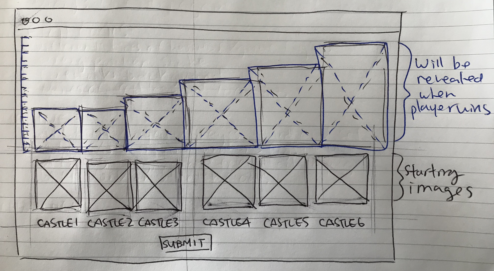
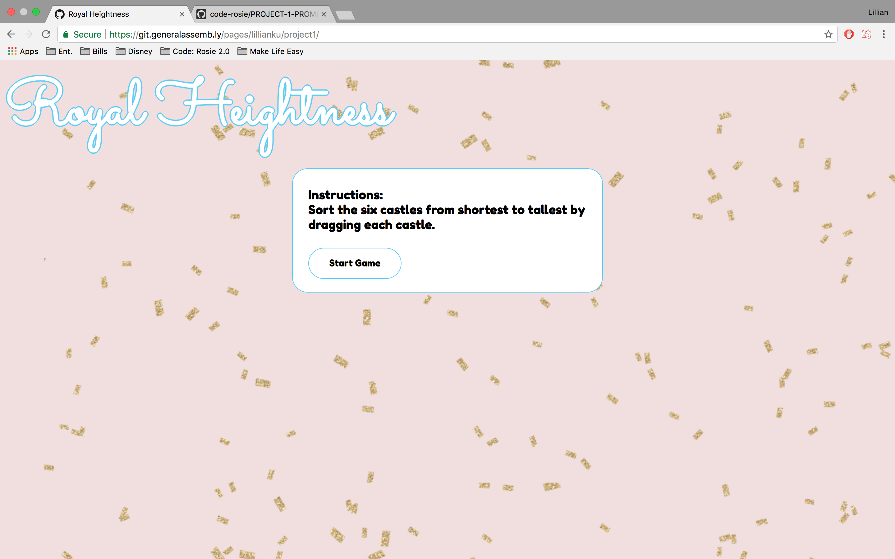
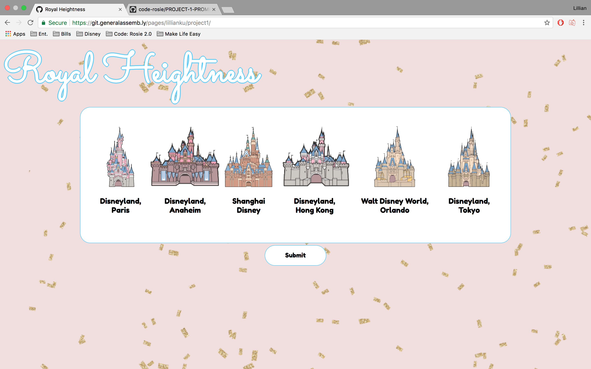
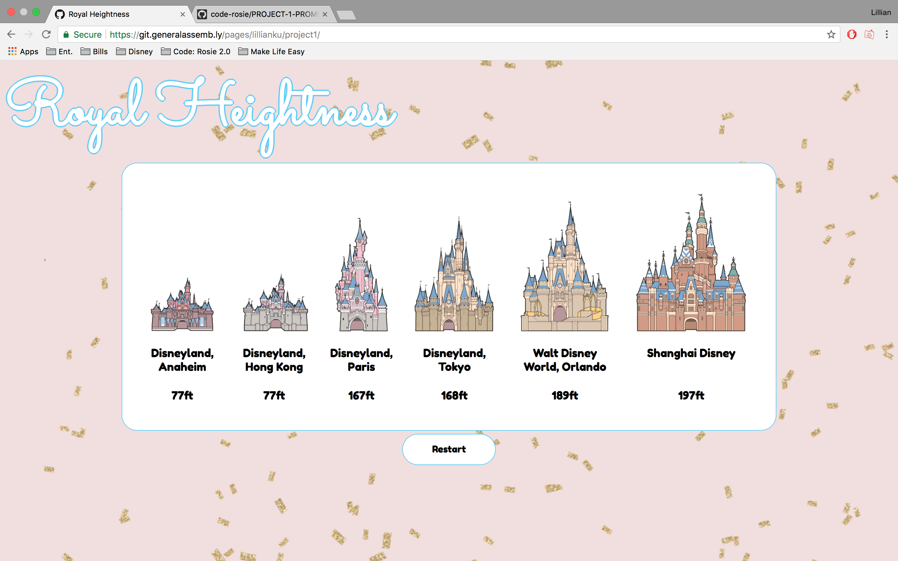

# Project 1 - Browser Game

## Project Proposal

### Introduction
The game is for the user to sort the castles from shortest to tallest. They will be able to either sort, drag, or input numbers to represent the order in which the user thinks they belong. When the user gets them in the correct order, the photos of the castles will then scale to their respectable sizes. If they get the order wrong, that's okay! They'll get a chance to try again.

### Technologies
  * **JQuery**
    - Make the castles draggable/sortable
    - To make toggle the reveal of the actual sizes
  * **CSS**
    - Make the webpage look presentable
    - Create a class that animates the reveal of the actual sizes
    - Help with the animation of the drags or sorting
  * **HTML**
    - Format the page so that the images are next to each other
    - Maybe add input forms to rank the castles (If I can't make them draggable/sortable)
    - Add titles/names to each castle
    - Create a submit button, and a "I give up" button if I have time
  * **Plan**
    - Break down the MVP step by step, and use pseudocode to figure out what I need, the basics.
    - Use the resources I have to overcome obstacles (notes, lectures, Google, buddy, etc.)

### MVP
Have 6 castles. Castles needs to be able to be sorted in some way from shortest to tallest. Needs to have a submit button. Needs to reveal the actual scaled heights of the Castles

### Goals
  * Names/labels for each castle
  * A grid or graph with measurements that shows the actual height difference
  * Ideally, I'd like to be able to make them draggable so that they can be placed into a designated area on the page

### Stretch Goals
  * Have different pages with different other games for other lines of business
  * If they get the positions wrong, the castles that are wrong will shake when they hit the submit button
  * Fireworks in the background when the actual heights are revealed

### Timeline
  * Day 1, **Monday**:
    - Find all images for the game
    - HTML and layout figured out and set on the page
  * Day 2, **Tuesday**:
    - JQuery pseudocode laid out on the JS page
    - Finish jQuery coding that's needed to sort the castles to the right height
    - Start on the animations needed for the reveal
  * Day 3, **Wednesday**:
    - Complete the animations needed for the reveal
    - CSS designed and executed on the page
  * Day 4, **Thursday**:
    - Finish up anything that's leftover and wasn't completed from the days before
    - Work on integrating goals and stretch goals into the page

### Wireframe

### Struggles
It was challenging to create a working function that would be able to verify the list items that were sorted by the user against the solutions arrays. I learned that having the pseudocode is really helpful, because it helped me better understand what part I was stuck on, and what I could do myself. I also struggled with animating the castle growth. Whenever I tried to animate the castles to grow slowly to reveal their actual heights, it would throw off the alignment of the castles. I wasn't able to figure out how to get the castles to scale to size, but I was able to just show the respective heights while still having them aligned.

### Game

[Royal Heightness](https://git.generalassemb.ly/pages/lillianku/project1/)

  * Start Page:

  * The Board:

  * Reveal Page:

### Future Goals
  * Identify the castles that are wrong, and animate them to shake
    - This will help the user know which ones they got correct, and which remaining ones they need to figure out
  * Animate the castles to grow and reveal the actual height, instead of them revealing quickly
  * Create different game plays with different themes
